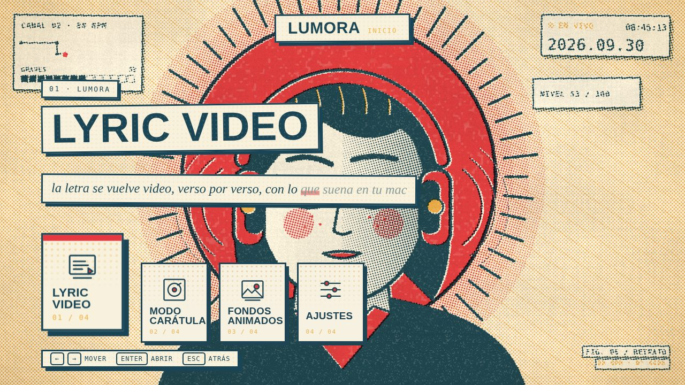
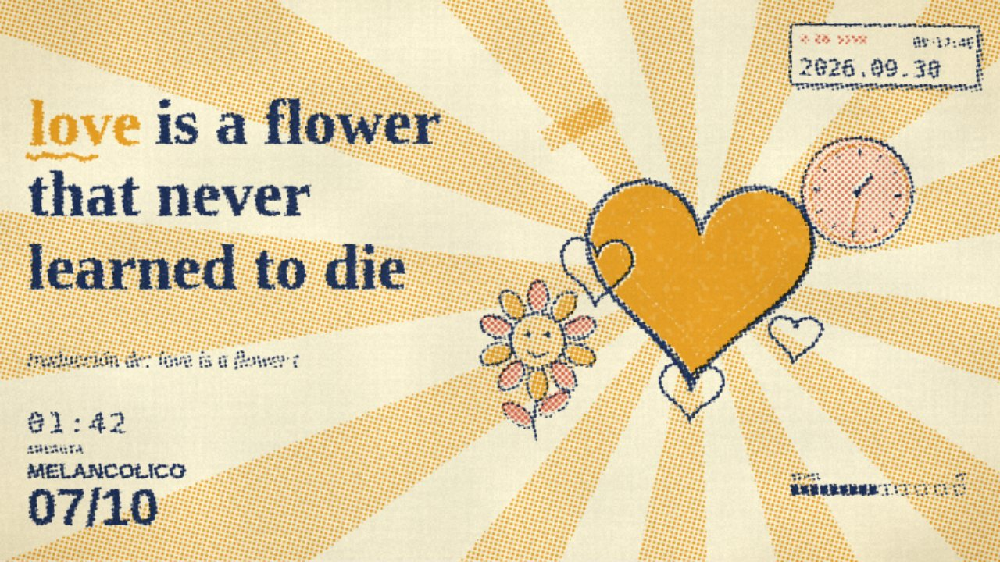
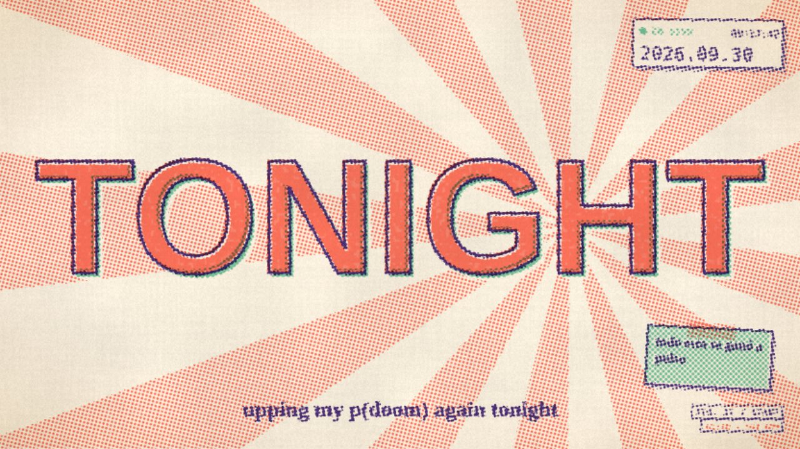
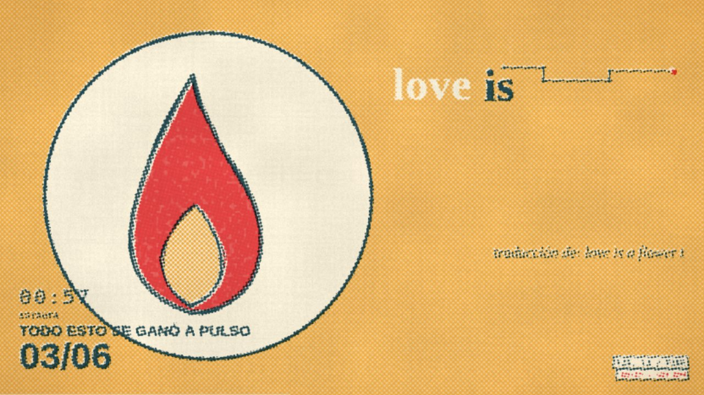

<h1 align="center">lumora</h1>
<p align="center"><em>tu música, hecha luz.</em></p>

<p align="center">
  <a href="https://kisnner26.github.io/lumora/app/"><b>probar en el navegador</b></a> ·
  <a href="https://kisnner26.github.io/lumora"><b>página del producto</b></a> ·
  <a href="https://kisnner26.github.io/lumora/#demo"><b>ver el promo (67 s)</b></a>
</p>

<p align="center">
  
  
  
</p>



lyric videos en vivo para lo que suena en tu mac. le das play en apple music o spotify y lumora arma el video solo: letra sincronizada, escenas ilustradas a mano en risografía, tipografía cinética y subtítulos traducidos. el guion lo escribe un director local que no necesita internet ni suscripción; claude es opcional.

| | |
|---|---|
|  |  |
|  |  |

## qué tiene

- **videoclip en risografía:** 31 escenas, más de 80 objetos que se dibujan solos y cortes con movimiento que siguen la energía de cada estrofa.
- **la letra se escribe a mano**, palabra por palabra, con la palabra clave subrayada y la traducción debajo (en↔es, pt→es con el traductor de apple en el dispositivo).
- **modo carátula:** la portada del álbum como protagonista, con ficha de la canción y póster del verso.
- **capturar un verso** (tecla `v`): foto PNG o video MP4 en 9:16, 4:5, 1:1 o 16:9 para compartir.
- **grabar clips en mp4** en horizontal o vertical, y modo de grabación para obs.
- **modo autor:** edita a mano el video de cualquier canción, escena por escena y verso por verso.
- **luces govee** por red local que siguen el color y el pulso de la canción.
- sin cuentas ni apis de pago para lo esencial; todo corre en tu mac.

el detalle completo está en [docs/FUNCIONES.md](docs/FUNCIONES.md).

## instalación

**descarga `Lumora.dmg`** (en las releases del repositorio), arrastra `Lumora.app` a Aplicaciones y ábrela. aparece un icono en la barra de menú, arranca el puente sola y abre lumora en su propia ventana; detecta lo que suena en Música o Spotify. la primera vez macOS pide permiso de Automatización para Música y Spotify (y Grabación de pantalla para el audio del sistema). mientras la app no esté notarizada, ábrela con clic derecho > abrir. cómo construirla y firmarla: `docs/DISTRIBUCION.md`.

si prefieres el código:

```sh
git clone https://github.com/kisnner26/lumora.git
cd lumora
./build.sh
python3 bridge.py
```

abre `http://127.0.0.1:8888/index.html` y dale play a cualquier canción. `,` abre los ajustes. para construir la app tú mismo: `tools/empaquetar.sh`.

### letras propias

si prefieres no depender de un servicio, pon tus letras en `~/Library/Application Support/Lumora/letras/` con el nombre `artista - título.lrc` (con tiempos) o `.txt` (sin tiempos). la letra propia tiene prioridad sobre lrclib.

## versión web (github pages)

**https://kisnner26.github.io/lumora/app/** corre lumora en el navegador, sin instalar nada: conectas spotify (login oficial de spotify, el token se queda en tu navegador) y al darle play a una canción lumora la detecta, trae la letra de lrclib y arma el video. no incluye lo que necesita la mac: traducción en el dispositivo, guion de claude, luces govee ni el análisis de audio del sistema. `js/app/web-bridge.js` reemplaza al puente de python; `tools/build_pages.sh` copia la app a `docs/app`. el client id de spotify va en `js/app/config-web.js` y, mientras la app de spotify esté en modo desarrollo, cada persona que la pruebe debe estar agregada por correo en el panel de spotify (hasta 25).

## cómo funciona

```
apple music / spotify ─► bridge.py (osascript) ─► http://127.0.0.1:8888
                               │                        │
          lrclib, deezer ◄─────┤                        ▼
     traductor de apple ◄──────┤                  index.html (canvas)
      claude (guion.py) ◄──────┤                        │
     luces govee (lan) ◄───────┘◄───────────────────────┘
```

`bridge.py` es un servidor local en python: vigila qué suena, trae la letra, pide el guion a claude y controla las luces. la página es html + canvas 2d, sin frameworks.

## requisitos

- macos 26 o más nuevo (el traductor en el dispositivo lo necesita)
- apple music o spotify de escritorio
- opcional: claude para el guion con ia, con tu suscripción vía [claude code](https://claude.com/claude-code) (`claude` en el terminal, con sesión iniciada) o una clave de api en `~/.config/lumora/anthropic_key`
- opcional: ffmpeg, para convertir clips webm a mp4 (la ventana propia ya graba mp4)
- para compilar desde el código: xcode command line tools

## documentación

- [funciones en detalle](docs/FUNCIONES.md) · [catálogo de dibujos](docs/CATALOGO.md)
- [decisiones de la app de mac](docs/DECISIONES-APP.md) · [distribución, firma y notarización](docs/DISTRIBUCION.md)
- [cómo contribuir](CONTRIBUTING.md) · [historial de cambios](CHANGELOG.md) · [seguridad](SECURITY.md)

## licencia

[polyform noncommercial 1.0.0](LICENSE.md): puedes usarlo, estudiarlo y modificarlo para uso personal y sin fines comerciales. para uso comercial (streams monetizados, eventos, integrarlo en un producto) hace falta una licencia comercial: [pídela aquí](https://github.com/kisnner26/lumora/issues/new?title=licencia%20comercial).

las letras, carátulas, logos y fotos que muestra la app pertenecen a sus dueños; lumora no las incluye, las consulta en vivo.
