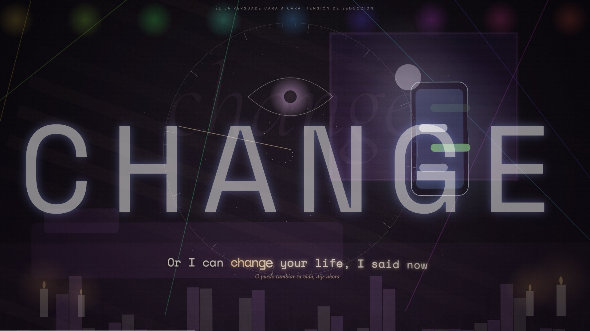
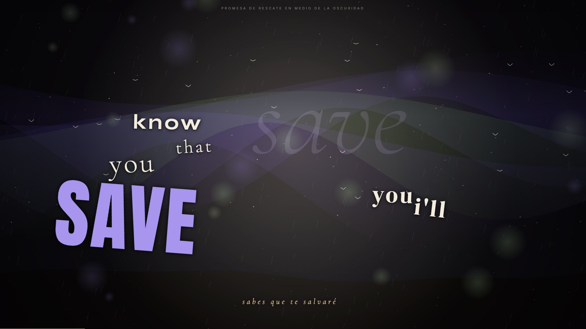
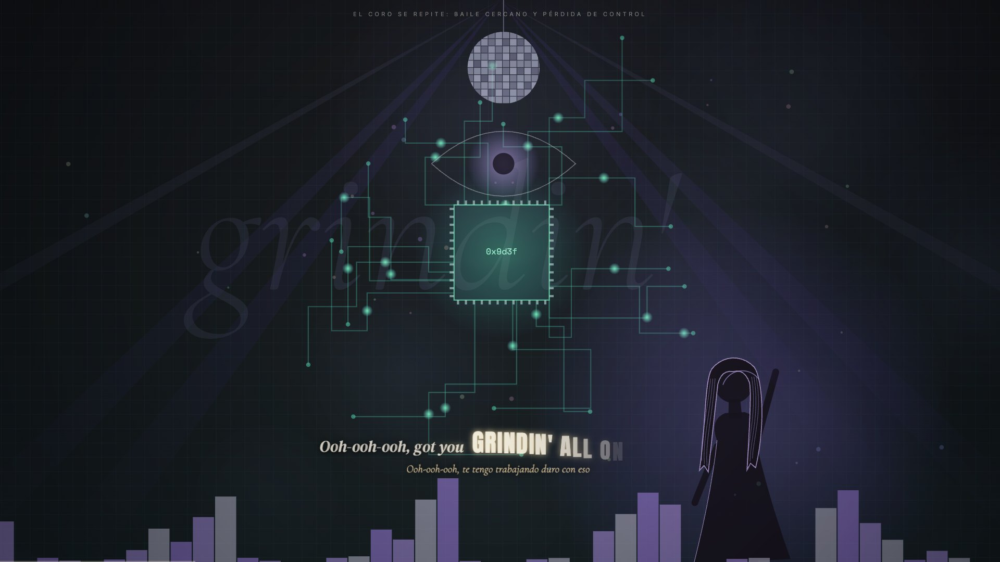
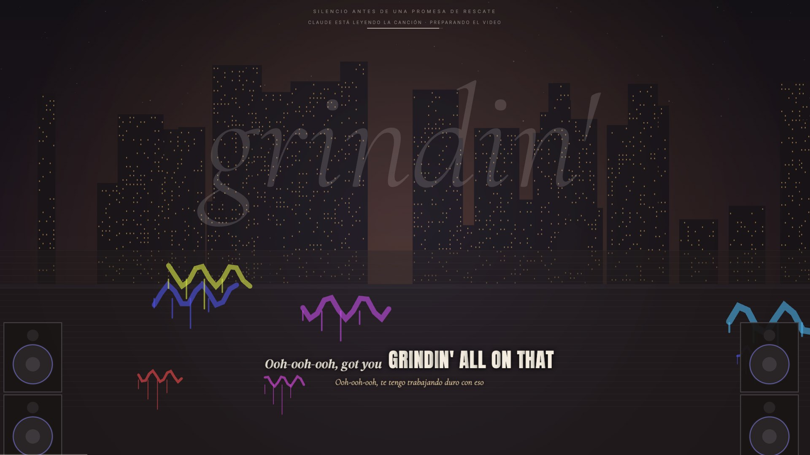
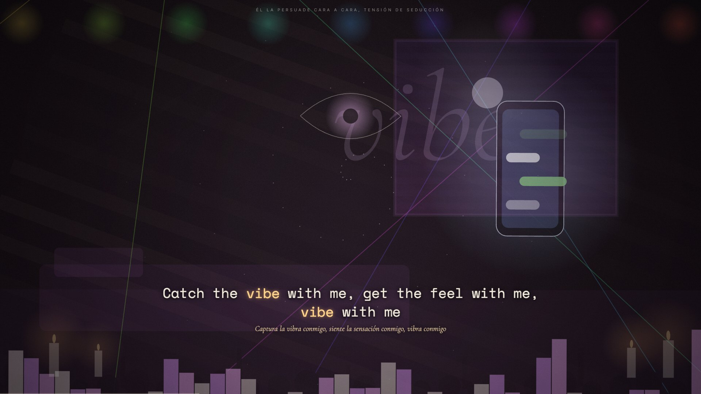

# verso

lyric videos en vivo para lo que suena en tu mac. le das play en apple music o spotify y verso arma el video solo: letra sincronizada letra por letra, escenarios procedurales, tipografía cinética y subtítulos traducidos. antes de empezar, claude lee la canción completa y decide qué se ve en cada verso, para que las imágenes tengan que ver con lo que dice la letra y no sean decoración al azar.

página del producto: **https://kisnner26.github.io/verso**



## capturas reales

| | |
|---|---|
|  |  |
|  |  |

todas salen de la app corriendo con canciones reales, sin retoques.

## qué hace

**el guion**
- claude (sonnet 5) lee la letra completa antes de que empiece la canción y escribe un guion por estrofa: escenario, objetos, ánimo, energía, hora del día, color y tipo de transición
- y por verso: qué aparece justo en ese verso, la palabra clave y cuándo va la palabra gigante en pantalla
- la lectura va por tramos en paralelo: el primero está listo en unos segundos y el resto termina mientras la canción ya suena. la música solo espera si el primer verso llega antes que el guion
- cada canción se analiza una vez; después arranca al instante

**lo visual**
- 20 escenarios procedurales (calle, playa, club, cielo, habitación, estadio, sistema, nebulosa, túnel, auroras…) y más de 80 objetos animados
- profundidad real con parallax, cámara que respira con el beat
- más de 35 transiciones (quiebre, glitch, remolino, iris, salto de velocidad…) elegidas según el carácter del cambio
- 10 composiciones tipográficas, letra que aparece letra por letra, palabra gigante en coros y drops
- figuras de personas, banderas reales, marcas con su logo oficial y fotos de las personas famosas que nombra la letra
- 48 perfiles de artista y estilos por género (r&b, pop, rap, reguetón, electrónica…)
- música electrónica sin letra: detector de beat y frases

**el resto**
- sincronía automática con apple music y spotify, sin cuentas ni apis de pago
- letras de lrclib; bpm de deezer; traducción en↔es y pt→es con el traductor de apple en el dispositivo
- luces govee por red local: color por compás, pulso en cada golpe, destello en los drops y brillo que sigue la intensidad de la canción
- grabar clips en mp4 de la duración que quieras
- modo grabación para obs (30 fps estables)
- panel de ajustes con todo lo de arriba, calidad automática según tu mac

 

## cómo funciona

```
apple music / spotify ─► bridge.py (osascript) ─► http://127.0.0.1:8888
                               │                        │
          lrclib, deezer ◄─────┤                        ▼
     traductor de apple ◄──────┤                  index.html (canvas)
      claude (guion.py) ◄──────┤                        │
     luces govee (lan) ◄───────┘◄───────────────────────┘
```

`bridge.py` es un servidor local en python: vigila qué suena, trae la letra, pide el guion a claude y controla las luces. la página es html + canvas 2d, sin frameworks.

## requisitos

- macos 26 o más nuevo (el traductor en el dispositivo lo necesita)
- apple music o spotify de escritorio
- claude: tu suscripción vía [claude code](https://claude.com/claude-code) (`claude` en el terminal, con sesión iniciada) o una clave de api en `~/.config/taxicab/anthropic_key`
- xcode command line tools para compilar las herramientas nativas

## instalación

```sh
git clone https://github.com/kisnner26/verso.git
cd verso
./build.sh
python3 bridge.py
```

abre `http://127.0.0.1:8888/index.html` y dale play a cualquier canción. `,` abre los ajustes.

## licencia

[polyform noncommercial 1.0.0](LICENSE.md): puedes usarlo, estudiarlo y modificarlo para uso personal y sin fines comerciales. para uso comercial (streams monetizados, eventos, integrarlo en un producto) hace falta una licencia comercial: [pídela aquí](https://github.com/kisnner26/verso/issues/new?title=licencia%20comercial).

las letras, carátulas, logos y fotos que muestra la app pertenecen a sus dueños; verso no las incluye, las consulta en vivo.
